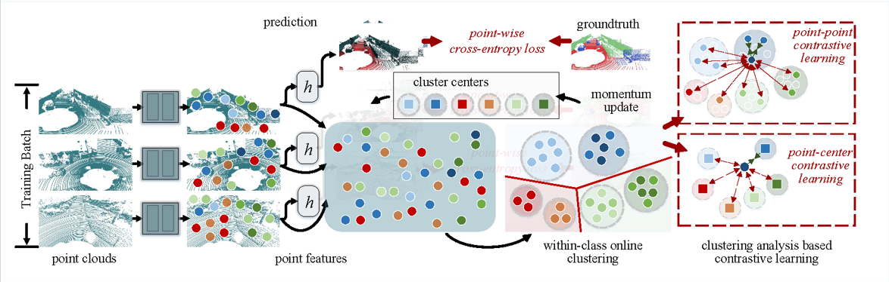

# Clustering based Point Cloud Representation Learning for 3D Analysis




>[Clustering based Point Cloud Representation Learning for 3D Analysis](https://arxiv.org/abs/2307.14605) <br>
>Tuo Feng, [Wenguan Wang](https://sites.google.com/view/wenguanwang), [Xiaohan Wang](https://scholar.google.com/citations?hl=zh-CN&user=iGA10XoAAAAJ), [Yi Yang](https://scholar.google.com/citations?hl=zh-CN&user=RMSuNFwAAAAJ&view_op=list_works), [Qinghua Zheng](https://gr.xjtu.edu.cn/web/qhzheng)


This repository is the official implementation of "Clustering based Point Cloud Representation Learning for 3D Analysis". 

## Requirements

The implementation has been based on SPVNAS, and the installation also follows [SPVNAS](https://github.com/mit-han-lab/spvnas). The details are as follows:

### Recommended Installation

For easy installation, use [conda](https://docs.conda.io/projects/conda/en/latest/):


```
conda create -n torch python=3.7
conda activate torch
conda install pytorch torchvision torchaudio cudatoolkit=10.2 -c pytorch
conda install numba opencv
pip install torchpack
pip install --upgrade git+https://github.com/mit-han-lab/torchsparse.git
```

### SemanticKITTI

Please follow the instructions from [semantic-kitti](http://www.semantic-kitti.org) to download the SemanticKITTI dataset (both KITTI Odometry dataset and SemanticKITTI labels) and extract all the files in the `sequences` folder to `/dataset/semantic-kitti`. You shall see 22 folders 00, 01, …, 21; each with subfolders named `velodyne` and `labels`.

Please replace the dataset root in `spvnas/configs/semantic_kitti/default.yaml` with the actual directory path of your dataset.


### Control file and pretrained models

The control file and pretrained models for SPVNAS<sub>10.8M</sub> were shared by [SPVNAS](https://github.com/mit-han-lab/spvnas). And the difference between SPVNAS<sub>12.5M</sub> and SPVNAS<sub>10.8M</sub> is that SPVNAS<sub>10.8M</sub> is trained except sequence 08. As for our implementation, SPVNAS<sub>10.8M</sub> and SPVNAS<sub>10.8M</sub> + Ours are trained on sequences 00-10 and evaluated on sequence 11-21.

We placed the Control file and SPVNAS<sub>10.8M</sub> pretrained model in `spvnas/configs/semantic_kitti/spvnas/net.config` and `SemanticKITTI_val_SPVNAS @65GMACs/init`, respectively. 

## Training

To train the models in the paper, run these commands:

```train
CUDA_VISIBLE_DEVICES=0 python spvnas/train_spvnas108m.py
```
and

```train
CUDA_VISIBLE_DEVICES=0 python spvnas/train_spvnas108m_cluster.py
```

## Evaluate the pretrained model

To evaluate the pretrained models, run:

```eval
CUDA_VISIBLE_DEVICES=0 python spvnas/test_spvnas108m.py
```

and

```eval
CUDA_VISIBLE_DEVICES=0 python spvnas/test_spvnas108m_cluster.py
```

Results will be stored in `./out` folder. Test performance can be evaluated by uploading label results onto the SemanticKITTI competition website [here](https://codalab.lisn.upsaclay.fr/competitions/6280).

Remember to shift label number back to the original dataset format before submitting! Instruction can be found in [semantic-kitti-api repo](https://github.com/PRBonn/semantic-kitti-api).

```shell
python remap_semantic_labels.py -p </your result path> -s test --inverse
```

## Pre-trained Models

Our pretrained models are provided here:

- [SPVNAS<sub>10.8M</sub>](https://1drv.ms/u/s!AqiWg_m4AbMfljH1qC_HKDEOh4AP?e=3KpaWl) is trained on sequence 00-10.
- [SPVNAS<sub>10.8M</sub> + Ours](https://1drv.ms/u/s!AqiWg_m4AbMfljI_5kf3JoigDjWu?e=xD1s4Q) is trained on sequence 00-10 with our cluster-analysis based contrastive learning algorithm.


## Results

The model achieves the following performance on SemanticKITTI Single-Scan test Challenge:

| Model name                     | mIoU  |
| :------------------:           |:-----:|
| SPVNAS<sub>10.8M</sub>         | 62.3  |
| SPVNAS<sub>10.8M</sub> + Ours  | 64.3  |


- `spvnas_10.8M.txt` and `spvnas_10.8M_cluster.txt` are the detailed test results for SPVNAS<sub>10.8M</sub> and SPVNAS<sub>10.8M</sub> + Ours. They are downloaded from the online server.

## Citation

If you find the code useful in your research, please consider citing our [paper](https://arxiv.org/pdf/2307.14605.pdf):

```
@inproceedings{feng2023clustering,
  title = {Clustering based Point Cloud Representation Learning for 3D Analysis},
  author = {Feng, Tuo and Wang, Wenguan and Wang, Xiaohan and Yang, Yi and Zheng, Qinghua},
  booktitle = {The IEEE International Conference on Computer Vision (ICCV)},  
  year = {2023}
}
```

Any comments, please email: feng.tuo@student.uts.edu.au.

## Acknowledgments
We thank for the opensource codebases: [ProtoSeg](https://github.com/tfzhou/ProtoSeg), [self-label](https://github.com/yukimasano/self-label), and [SPVNAS](https://github.com/mit-han-lab/spvnas). 

